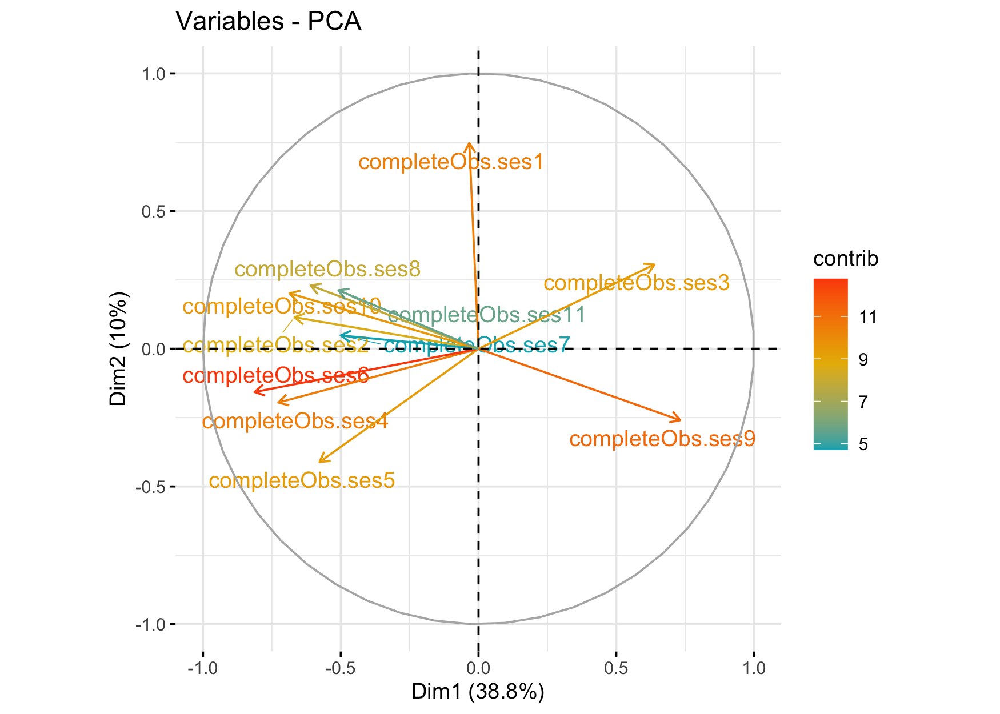

Stability-of-School-Academic-Perfomance-Longitudinal-Case (2015-2019)
=====================================================================

### Yuliya Kersha, Roman Zviagintsev

<details> <summary style="font-size: 18px; font-weight: bold;"><span style="font-size: 18px; font-weight: bold;">Data preparation</span></summary>

### Constructing a socioeconomic status (SES) index for schools

Firstly we work with a school-level database containing information about school staff and resources in year 2019 to construct an index of schools' socio-economic status (SES). To create the index, we selected 11 variables that have been shown to have significant relationships with children's outcomes in our previous studies. These variables characterize the contingent of students and their families in the educational organization, as well as the equipment of schools with technical and material resources.

The selected variables are as follows:

-   **ses1**: number of computers connected to the Internet per student
-   **ses2**: share of students at school enrolled in specialized classes
-   **ses3**: share of teachers who receive salaries from 260$ to 390$
-   **ses4**: share of teachers receiving salaries above 635$
-   **ses5**: share of pupils in school, from families in which both parents work
-   **ses6**: share of pupils in school, from families in which both parents have higher education
-   **ses7-8**: share of families with high and very high income
-   **ses9**: share of families with fewer than 100 books at home
-   **ses10**: share of families with 250-500 books at home
-   **ses11**: share of families with more than 1,000 books at home

After selecting the relevant variables for constructing the SES index, we imported the school-level data from an Excel file and convereted **ses** variables to numeric data type. Next, we calculated descriptive statistics for the selected variables. The output of the descriptive statistics is shown below:

``` r
library(readxl)
ses <- read_excel("ses.xlsx", na="NA")
ses[, 2:12] <- lapply(ses[, 2:12], as.numeric)

summary(ses[, 2:12])
```

    ##       ses1              ses2              ses3             ses4       
    ##  Min.   :0.00000   Min.   :0.00000   Min.   :0.0000   Min.   :0.0000  
    ##  1st Qu.:0.05335   1st Qu.:0.00000   1st Qu.:0.2206   1st Qu.:0.0000  
    ##  Median :0.09900   Median :0.00000   Median :0.4000   Median :0.0488  
    ##  Mean   :0.12545   Mean   :0.03223   Mean   :0.3967   Mean   :0.1319  
    ##  3rd Qu.:0.16240   3rd Qu.:0.04975   3rd Qu.:0.5785   3rd Qu.:0.2000  
    ##  Max.   :1.08620   Max.   :0.43220   Max.   :1.0000   Max.   :1.0000  
    ##                                      NA's   :3        NA's   :3       
    ##       ses5             ses6             ses7             ses8        
    ##  Min.   :0.0000   Min.   :0.0000   Min.   :0.0000   Min.   :0.00000  
    ##  1st Qu.:0.2991   1st Qu.:0.0139   1st Qu.:0.2778   1st Qu.:0.00000  
    ##  Median :0.5067   Median :0.0796   Median :0.3817   Median :0.05410  
    ##  Mean   :0.4980   Mean   :0.1629   Mean   :0.3688   Mean   :0.05979  
    ##  3rd Qu.:0.6951   3rd Qu.:0.2596   3rd Qu.:0.4667   3rd Qu.:0.09030  
    ##  Max.   :1.0000   Max.   :1.0000   Max.   :0.8000   Max.   :0.28570  
    ##                                    NA's   :2        NA's   :2        
    ##       ses9            ses10             ses11        
    ##  Min.   :0.0308   Min.   :0.00000   Min.   :0.00000  
    ##  1st Qu.:0.5969   1st Qu.:0.00000   1st Qu.:0.00000  
    ##  Median :0.7189   Median :0.05880   Median :0.00000  
    ##  Mean   :0.6934   Mean   :0.07213   Mean   :0.01083  
    ##  3rd Qu.:0.8222   3rd Qu.:0.11110   3rd Qu.:0.01440  
    ##  Max.   :1.0000   Max.   :0.57630   Max.   :0.20000  
    ##  NA's   :2        NA's   :2         NA's   :2

``` r
sapply(ses, function(x) sum(is.na(x)))
```

    ##    id  ses1  ses2  ses3  ses4  ses5  ses6  ses7  ses8  ses9 ses10 ses11 
    ##     0     0     0     3     3     0     0     2     2     2     2     2

To create the SES index for our school data, we used Principal Component Analysis (PCA). This method was selected because it allows us to reduce the dimensionality of the data while retaining as much information as possible. However, you can notice, that some variables in the dataset have missing values. Since PCA does not work with missing data, we used the `missMDA` R package to impute missing values in the dataset. We chose PCA-based imputation because it is particularly suitable for high-dimensional datasets like ours. This type of imputation calculates correlations between the variables in the dataset and uses this information to fill in missing values.

``` r
library(missMDA)
```

    ## Warning: package 'missMDA' was built under R version 4.0.2

``` r
numb_comp <- estim_ncpPCA(ses[,c(2:12)], ncp.min=0, ncp.max=5)
ses_imp <- imputePCA(ses[,c(2:12)],ncp=numb_comp$ncp)
ses_imp <-as.data.frame(ses_imp) 

sapply(ses_imp[,c(1:11)], function(x) sum(is.na(x)))
```

    ##  completeObs.ses1  completeObs.ses2  completeObs.ses3  completeObs.ses4 
    ##                 0                 0                 0                 0 
    ##  completeObs.ses5  completeObs.ses6  completeObs.ses7  completeObs.ses8 
    ##                 0                 0                 0                 0 
    ##  completeObs.ses9 completeObs.ses10 completeObs.ses11 
    ##                 0                 0                 0

Now there are no missing values in the data and we can move on to PCA.

``` r
library(factoextra)
```

    ## Loading required package: ggplot2

    ## Warning: package 'ggplot2' was built under R version 4.0.2

    ## Welcome! Want to learn more? See two factoextra-related books at https://goo.gl/ve3WBa

``` r
pca_ses <- prcomp(ses_imp[,c(1:11)], center=T, scale=T)
summary(pca_ses)
```

    ## Importance of components:
    ##                           PC1    PC2     PC3     PC4     PC5     PC6     PC7
    ## Standard deviation     2.0650 1.0510 0.98239 0.97197 0.92134 0.86267 0.81088
    ## Proportion of Variance 0.3877 0.1004 0.08773 0.08588 0.07717 0.06765 0.05978
    ## Cumulative Proportion  0.3877 0.4881 0.57582 0.66170 0.73887 0.80653 0.86630
    ##                            PC8     PC9    PC10    PC11
    ## Standard deviation     0.74357 0.59637 0.55662 0.50230
    ## Proportion of Variance 0.05026 0.03233 0.02817 0.02294
    ## Cumulative Proportion  0.91656 0.94890 0.97706 1.00000

``` r
fviz_eig(pca_ses)
```


``` r
fviz_pca_var(pca_ses,
             col.var = "contrib", # Color by contributions to the PC
             gradient.cols = c("#00AFBB", "#E7B800", "#FC4E07"),
             repel = TRUE     # Avoid text overlapping
            )
```



Our analysis reveals that one factor stands out prominently in the data, explaining almost 40% of the variance in the original database. To simplify the interpretation of the loading scores on this first component, we also applied a Varimax rotation. This is a widely used technique in factor analysis that maximizes the variance of the squared loadings of each variable on a given component, while minimizing the cross-factor correlations.

``` r
rawLoadings_matrix <- pca_ses$rotation[, 1:2] %*% diag(pca_ses$sdev[1:2])
rawLoadings <- as.vector(rawLoadings_matrix[, 1])
rotatedLoadings <- varimax(rawLoadings_matrix)$loadings[, 1]
print(round(rotatedLoadings, 3))
```

    ##  completeObs.ses1  completeObs.ses2  completeObs.ses3  completeObs.ses4 
    ##            -0.397            -0.638             0.405            -0.536 
    ##  completeObs.ses5  completeObs.ses6  completeObs.ses7  completeObs.ses8 
    ##            -0.300            -0.630            -0.459            -0.644 
    ##  completeObs.ses9 completeObs.ses10 completeObs.ses11 
    ##             0.765            -0.696            -0.547

To ensure that higher values on the first component represent higher school SES and greater resource availability of the school, we multiplied the loadings by -1. The resulting loadings for each of the variables are as follows:

``` r
library(knitr)
invLoadings <- round ((-1 * rotatedLoadings),3)
var_desc <- c("Number of computers connected to the Internet per student", "share of students at school enrolled in specialized classes", "Share of teachers who receive salaries from 260$ to 390$", "Share of teachers receiving salaries above 635$", "Share of pupils in school, from families in which both parents work", "Share of pupils in school, from families in which both parents have higher education", "Share of families with high income", "Share of families with very high income", "Share of families with fewer than 100 books at home", "Share of families with 250-500 books at home", "Share of families with more than 1,000 books at home")
loadings_table <- cbind(var_desc, invLoadings)
knitr::kable(loadings_table, align = rep("c", ncol(loadings_table)), 
      col.names = c("Variable", "Loading"))
```

<table>
<colgroup>
<col width="16%" />
<col width="75%" />
<col width="8%" />
</colgroup>
<thead>
<tr class="header">
<th align="left"></th>
<th align="center">Variable</th>
<th align="center">Loading</th>
</tr>
</thead>
<tbody>
<tr class="odd">
<td align="left">completeObs.ses1</td>
<td align="center">Number of computers connected to the Internet per student</td>
<td align="center">0.397</td>
</tr>
<tr class="even">
<td align="left">completeObs.ses2</td>
<td align="center">share of students at school enrolled in specialized classes</td>
<td align="center">0.638</td>
</tr>
<tr class="odd">
<td align="left">completeObs.ses3</td>
<td align="center">Share of teachers who receive salaries from 260$ to 390$</td>
<td align="center">-0.405</td>
</tr>
<tr class="even">
<td align="left">completeObs.ses4</td>
<td align="center">Share of teachers receiving salaries above 635$</td>
<td align="center">0.536</td>
</tr>
<tr class="odd">
<td align="left">completeObs.ses5</td>
<td align="center">Share of pupils in school, from families in which both parents work</td>
<td align="center">0.3</td>
</tr>
<tr class="even">
<td align="left">completeObs.ses6</td>
<td align="center">Share of pupils in school, from families in which both parents have higher education</td>
<td align="center">0.63</td>
</tr>
<tr class="odd">
<td align="left">completeObs.ses7</td>
<td align="center">Share of families with high income</td>
<td align="center">0.459</td>
</tr>
<tr class="even">
<td align="left">completeObs.ses8</td>
<td align="center">Share of families with very high income</td>
<td align="center">0.644</td>
</tr>
<tr class="odd">
<td align="left">completeObs.ses9</td>
<td align="center">Share of families with fewer than 100 books at home</td>
<td align="center">-0.765</td>
</tr>
<tr class="even">
<td align="left">completeObs.ses10</td>
<td align="center">Share of families with 250-500 books at home</td>
<td align="center">0.696</td>
</tr>
<tr class="odd">
<td align="left">completeObs.ses11</td>
<td align="center">Share of families with more than 1,000 books at home</td>
<td align="center">0.547</td>
</tr>
</tbody>
</table>

We saved the resulting SES index, in the form of the first component values derived from applying PCA in a dataset with school data along with school category (low, middle and high SES schools).

``` r
library(dplyr)
```

    ## Warning: package 'dplyr' was built under R version 4.0.2

    ## 
    ## Attaching package: 'dplyr'

    ## The following objects are masked from 'package:stats':
    ## 
    ##     filter, lag

    ## The following objects are masked from 'package:base':
    ## 
    ##     intersect, setdiff, setequal, union

``` r
scores <- scale(pca_ses$x[,1:2]) %*% varimax(rawLoadings_matrix)$rotmat
school_dat <- data.frame(ses, SES = scores[, 1])
school_dat$ses_group <- ntile(school_dat$SES, 3)
school_dat$ses_group <- factor(school_dat$ses_group, labels = c("Low", "Medium", "High"))
```

### Merging school data with USE scores

We used the results of graduates in the Unified State Examination (USE) in Russian and Math (only for 11th-grade students) as indicators of academic achievement for all schools in our database. To create a complete database, we merged the school\_data file with individual USE results of students for five years, from 2015 to 2019.

``` r
use <- read_excel("use.xlsx", na="NA")
ach_data <- merge(use, school_dat, by = "id")
```

</details>

Analysis of Unified State Examination (USE) Results in the Region from 2015-2019
--------------------------------------------------------------------------------

### Investigating the Stability of Academic Performance in Schools

**Research Question 1: How stable is a school's academic performance across years in Russian and math?**

To explore the stability of academic performance in schools over the five-year period from 2015 to 2019, we conducted exploratory visual analysis. To help us better understand the data, we firstly created a graph showing the dynamics of USE results in Russian and math for each school.

``` r
ach_data$subject <- as.factor(ach_data$subject)
ach_data$id <- as.character(ach_data$id)

## to sort schools in descending order by their achievement
graph1_ord <- ach_data %>%
  group_by(id) %>%
  summarise(ach = mean(use, na.rm = TRUE)) %>%
  arrange(ach) %>%
  mutate(id = factor(id, levels = .$id))

graph1 <- ach_data %>%
  group_by(id, year) %>%
  summarise(ach = mean(use, na.rm = TRUE)) %>%
  ungroup() %>%
  mutate(id = factor(id, levels = graph1_ord$id))
```

    ## `summarise()` has grouped output by 'id'. You can override using the `.groups`
    ## argument.

``` r
library(ggthemes)
```

    ## Warning: package 'ggthemes' was built under R version 4.0.2

``` r
ggplot(graph1, aes(ach, id)) +
  geom_point(aes(color = year), size=2.2, alpha = 0.9)+
  scale_color_gradient(low = "darkblue", high ="cyan3" , na.value = NA)+
  theme_tufte()+
  theme(axis.text.y=element_blank(),
        axis.title.y = element_blank(),
        axis.ticks.y = element_blank(),
        axis.title.x.bottom = element_blank(),
        panel.grid = element_line(colour = "gray66", size=0.1),
        panel.grid.major.x =element_line(colour = "grey54", size=0.1),
        panel.grid.minor.x =element_line(colour = "grey54", size=0.1),
        axis.text.x=element_text(colour="#253856", size=10, family = "Arial"),
        legend.key.size = unit(0.8, "cm"),
        legend.position = "bottom",
        legend.title =  element_blank(),
        legend.text = element_text(colour="#253856", size=10, family = "Arial")
  )+ xlim(0, 100)
```

    ## Warning: Removed 7 rows containing missing values (geom_point).


The graph we are looking at shows the mean USE results for schools in the region over five years from 2015 to 2019. Each data point in the graph represents a school's average performance for a particular year. Lighter points indicate more recent years, and the horizontal line represents the school itself, typically showing five data points, one for each year. Schools are sorted in descending order based on their mean academic performance for five years. The graph reveals interesting patterns about the academic performance of schools in the region.

The first pattern that we notice is a slight upward trend in the mean USE results over the five-year period. In 2015, the average score for the exam was 54, while in 2019, it increased to 61. This indicates that the overall academic performance of schools in the region has improved slightly over time.

Another interesting finding from the graph is the relationship between the mean achievement of schools and their stability over time. As we move up the graph and toward schools with higher mean scores, the variability in the data from year to year seems to decrease. In other words, the schools with the highest mean scores seem to be the most stable from year to year, while schools with lower mean scores exhibit greater variability. This observation is supported by a correlation test, which shows that the variance of all students' USE results from 2015-2019 in each school is weakly but significantly correlated with the mean scores of achievement in 2015-2019 for the school. This suggests that schools that consistently perform well tend to maintain that level of performance, while those that perform poorly tend to have more fluctuation in their results.

``` r
variance_data <- ach_data %>%
     group_by(id) %>%
     summarize(variance = var(use, na.rm = TRUE)) %>%
     arrange(variance)
ach_var <- merge(graph1_ord, variance_data, by = "id")
cor.test(ach_var$ach, ach_var$variance, method = "pearson")
```

    ## 
    ##  Pearson's product-moment correlation
    ## 
    ## data:  ach_var$ach and ach_var$variance
    ## t = -3.2146, df = 277, p-value = 0.001461
    ## alternative hypothesis: true correlation is not equal to 0
    ## 95 percent confidence interval:
    ##  -0.30038268 -0.07385353
    ## sample estimates:
    ##        cor 
    ## -0.1896405

In examining academic performance stability, it's important to consider the potential difference in stability between different subjects. Our analysis focused on Russian and math results, and we stumbled upon a significant distinction between the two.

``` r
graph2 <- ach_data %>%
  group_by(id, year, subject) %>%
  summarise(ach = mean(use, na.rm = TRUE)) %>%
  ungroup() %>%
  mutate(id = factor(id, levels = graph1_ord$id))
```

    ## `summarise()` has grouped output by 'id', 'year'. You can override using the
    ## `.groups` argument.

``` r
ggplot(graph2, aes(ach, id, subject)) +
  geom_point(aes(color = subject), size=2.2, alpha = 0.8)+
  scale_color_manual(values=c("darkblue","cyan3"), labels = c('Mathematics', 'Russian'))+
  theme_tufte()+
  theme(axis.text.y=element_blank(),
        axis.title.y = element_blank(),
        axis.ticks.y = element_blank(),
        axis.title.x.bottom = element_blank(),
        panel.grid = element_line(colour = "gray66", size=0.1),
        panel.grid.major.x =element_line(colour = "grey54", size=0.1),
        panel.grid.minor.x =element_line(colour = "grey54", size=0.1),
        axis.text.x=element_text(colour="#253856", size=10, family = "Arial"),
        legend.key.size = unit(0.8, "cm"),
        legend.position = "bottom",
        legend.title =  element_blank(),
        legend.text = element_text(colour="#253856", size=12, family = "Arial")
  ) + guides(colour = guide_legend(override.aes = list(size=4.5)))+
  xlim(0, 100)
```

    ## Warning: Removed 110 rows containing missing values (geom_point).


When we created a graph with school mean score distributions for each subject, we found that not only were the scores for the Russian exam higher, but they also exhibited lower variability. In other words, schools tend to have more consistent results in the Russian subject exam from year to year compared to math. Our visual analysis was further supported by the results of a paired t-test, which compared the variance of individual scores for each school from 2015-2019 in Russian and math. The difference was found to be statistically significant, indicating that scores in Russian have lower variance compared to math. These findings underscore the importance of subject-specific analysis when examining academic performance stability.

``` r
library(tidyr)
```

    ## Warning: package 'tidyr' was built under R version 4.0.2

``` r
variance_data_subj <- ach_data %>%
     group_by(id, subject) %>%
     summarize(variance = var(use, na.rm = TRUE))
```

    ## `summarise()` has grouped output by 'id'. You can override using the `.groups`
    ## argument.

``` r
variance_data_subj <- variance_data_subj %>%
  group_by(id) %>%
  filter(all(c("math", "rus") %in% subject)) %>%
  pivot_wider(names_from = subject, values_from = variance) %>%
  drop_na() 

t.test(variance_data_subj$rus, variance_data_subj$math, paired = TRUE)
```

    ## 
    ##  Paired t-test
    ## 
    ## data:  variance_data_subj$rus and variance_data_subj$math
    ## t = -9.4092, df = 275, p-value < 2.2e-16
    ## alternative hypothesis: true difference in means is not equal to 0
    ## 95 percent confidence interval:
    ##  -72.41376 -47.35530
    ## sample estimates:
    ## mean of the differences 
    ##               -59.88453

### Stability of Academic Performance for Schools With Different SES

**Research question 2: Does the stability of academic performance differ across schools with varying levels of socioeconomic status (SES)?**

We've already seen that high-performing schools tend to be more stable in their academic performance than low-performing ones. But does this trend hold true across schools with varying levels of socioeconomic status? We're particularly interested in exploring whether well-resourced schools with more privileged student populations maintain a more consistent level of achievement. To find out, we will take a closer look at the distribution of results on the Russian exam for high and low-SES schools using a graph.

``` r
graph3 <- ach_data %>%
  filter(subject == "rus", ses_group %in% c("Low", "High")) %>%
  group_by(id, year, ses_group) %>%
  summarise(ach = mean(use, na.rm = TRUE)) %>%
  ungroup() %>%
  mutate(id = factor(id, levels = graph1_ord$id))
```

    ## `summarise()` has grouped output by 'id', 'year'. You can override using the
    ## `.groups` argument.

``` r
ggplot(graph3, aes(ach, id, ses_group)) +
  geom_point(aes(color = ses_group), size=2.2, alpha = 0.9)+
  scale_color_manual(values=c("darkblue","cyan3"), labels = c('High SES', 'Low SES'))+
  theme_tufte()+
  theme(axis.text.y=element_blank(),
        axis.title.y = element_blank(),
        axis.ticks.y = element_blank(),
        axis.title.x.bottom = element_blank(),
        panel.grid = element_line(colour = "gray66", size=0.1),
        panel.grid.major.x =element_line(colour = "grey54", size=0.1),
        panel.grid.minor.x =element_line(colour = "grey54", size=0.1),
        axis.text.x=element_text(colour="#253856", size=10, family = "Arial"),
        legend.key.size = unit(0.8, "cm"),
        legend.position = "bottom",
        legend.title =  element_blank(),
        legend.text = element_text(colour="#253856", size=12, family = "Arial")
  ) + guides(colour = guide_legend(override.aes = list(size=4.5)))+
  xlim(0, 100)
```

    ## Warning: Removed 2 rows containing missing values (geom_point).


Based on the picture, it seems that high-achieving schools are more consistent in their results than low-achieving ones. Another expected trend to note: high-achieving schools are more likely to fall into the high-SES category. The visual trend was also confirmed with a statistical test. We calculated the correlation between individual exam results and school SES. The results showed a weak but significant positive correlation (0.22), proving that high-SES schools show more stable results in Russian from year to year.

``` r
library(tidyr)
variance_data_rus <- ach_data %>%
     filter(subject == "rus") %>%
     group_by(ses_group, id) %>%
     summarize(variance = var(use, na.rm = TRUE))
```

    ## `summarise()` has grouped output by 'ses_group'. You can override using the
    ## `.groups` argument.

``` r
variance_data_rus <- merge(select(school_dat, id, SES), variance_data_rus, by = "id")
cor.test(variance_data_rus$SES, variance_data_rus$variance, method = "pearson")
```

    ## 
    ##  Pearson's product-moment correlation
    ## 
    ## data:  variance_data_rus$SES and variance_data_rus$variance
    ## t = 3.8414, df = 277, p-value = 0.0001517
    ## alternative hypothesis: true correlation is not equal to 0
    ## 95 percent confidence interval:
    ##  0.1103762 0.3335165
    ## sample estimates:
    ##       cor 
    ## 0.2248929

When we examine the graph for math exam results, the pattern we observed with the Russian exam becomes less clear. While high-SES schools again tend to score higher on average, there is no obvious trend towards lower variability of scores for these schools. To get a better understanding of the relationship between school socioeconomic status and academic performance stability, we calculated the correlation coefficient between individual results variance at schools and their SES. Surprisingly, we found a very weak negative relationship. This suggests that, unlike with the Russian exam, high-SES schools do not have any advantages when it comes to maintaining consistent student performance in math. This could indicate that the contribution of school characteristics to academic performance stability may be lower for math.

``` r
graph4 <- ach_data %>%
  filter(subject == "math", ses_group %in% c("Low", "High")) %>%
  group_by(id, year, ses_group) %>%
  summarise(ach = mean(use, na.rm = TRUE)) %>%
  ungroup() %>%
  mutate(id = factor(id, levels = graph1_ord$id))
```

    ## `summarise()` has grouped output by 'id', 'year'. You can override using the
    ## `.groups` argument.

``` r
ggplot(graph4, aes(ach, id, ses_group)) +
  geom_point(aes(color = ses_group), size=2.2, alpha = 0.9)+
  scale_color_manual(values=c("darkblue","cyan3"), labels = c('High SES', 'Low SES'))+
  theme_tufte()+
  theme(axis.text.y=element_blank(),
        axis.title.y = element_blank(),
        axis.ticks.y = element_blank(),
        axis.title.x.bottom = element_blank(),
        panel.grid = element_line(colour = "gray66", size=0.1),
        panel.grid.major.x =element_line(colour = "grey54", size=0.1),
        panel.grid.minor.x =element_line(colour = "grey54", size=0.1),
        axis.text.x=element_text(colour="#253856", size=10, family = "Arial"),
        legend.key.size = unit(0.8, "cm"),
        legend.position = "bottom",
        legend.title =  element_blank(),
        legend.text = element_text(colour="#253856", size=12, family = "Arial")
  ) + guides(colour = guide_legend(override.aes = list(size=4.5)))+
  xlim(0, 100)
```

    ## Warning: Removed 73 rows containing missing values (geom_point).


``` r
variance_data_math <- ach_data %>%
     filter(subject == "math") %>%
     group_by(ses_group, id) %>%
     summarize(variance = var(use, na.rm = TRUE))
```

    ## `summarise()` has grouped output by 'ses_group'. You can override using the
    ## `.groups` argument.

``` r
variance_data_math <- merge(select(school_dat, id, SES), variance_data_math, by = "id")
cor.test(variance_data_math$SES, variance_data_math$variance, method = "pearson")
```

    ## 
    ##  Pearson's product-moment correlation
    ## 
    ## data:  variance_data_math$SES and variance_data_math$variance
    ## t = -2.1763, df = 274, p-value = 0.03039
    ## alternative hypothesis: true correlation is not equal to 0
    ## 95 percent confidence interval:
    ##  -0.24465770 -0.01247692
    ## sample estimates:
    ##       cor 
    ## -0.130354

### School Contribution to The Academic Performance

**Research question 3: How much of the individual performance variance can be attributed to the school?**

Another intriguing aspect of our research question is examining the extent to which individual data variability can be attributed to students' membership in a particular school. In other words, how much of the variance in academic performance results can be explained by the school? We are curious to know if a student's results are better explained by the year of graduation, their individual background, or characteristics of their school. To explore this, we utilized hierarchical three-level models with students as the first level, years as the second level, and schools as the third level. Our model assumes that the influence of grouping variables is not separate, which helps to capture any additional variation in intercepts unique to each year within the school.

``` r
library(lme4)
```

    ## Warning: package 'lme4' was built under R version 4.0.2

    ## Loading required package: Matrix

    ## 
    ## Attaching package: 'Matrix'

    ## The following objects are masked from 'package:tidyr':
    ## 
    ##     expand, pack, unpack

``` r
library(sjstats)
library(sjPlot)
```

    ## Install package "strengejacke" from GitHub (`devtools::install_github("strengejacke/strengejacke")`) to load all sj-packages at once!

``` r
rus_mod <- lmer(use ~ 1 + (1 | id/year), data = ach_data, subset = subject == "rus")
tab_model(rus_mod, show.icc = FALSE)
```

<table style="border-collapse:collapse; border:none;">
<tr>
<th style="border-top: double; text-align:center; font-style:normal; font-weight:bold; padding:0.2cm;  text-align:left; ">
 
</th>
<th colspan="3" style="border-top: double; text-align:center; font-style:normal; font-weight:bold; padding:0.2cm; ">
use
</th>
</tr>
<tr>
<td style=" text-align:center; border-bottom:1px solid; font-style:italic; font-weight:normal;  text-align:left; ">
Predictors
</td>
<td style=" text-align:center; border-bottom:1px solid; font-style:italic; font-weight:normal;  ">
Estimates
</td>
<td style=" text-align:center; border-bottom:1px solid; font-style:italic; font-weight:normal;  ">
CI
</td>
<td style=" text-align:center; border-bottom:1px solid; font-style:italic; font-weight:normal;  ">
p
</td>
</tr>
<tr>
<td style=" padding:0.2cm; text-align:left; vertical-align:top; text-align:left; ">
(Intercept)
</td>
<td style=" padding:0.2cm; text-align:left; vertical-align:top; text-align:center;  ">
61.51
</td>
<td style=" padding:0.2cm; text-align:left; vertical-align:top; text-align:center;  ">
60.73 – 62.29
</td>
<td style=" padding:0.2cm; text-align:left; vertical-align:top; text-align:center;  ">
<strong>&lt;0.001</strong>
</td>
</tr>
<tr>
<td colspan="4" style="font-weight:bold; text-align:left; padding-top:.8em;">
Random Effects
</td>
</tr>
<tr>
<td style=" padding:0.2cm; text-align:left; vertical-align:top; text-align:left; padding-top:0.1cm; padding-bottom:0.1cm;">
σ<sup>2</sup>
</td>
<td style=" padding:0.2cm; text-align:left; vertical-align:top; padding-top:0.1cm; padding-bottom:0.1cm; text-align:left;" colspan="3">
181.17
</td>
</tr>
<tr>
<td style=" padding:0.2cm; text-align:left; vertical-align:top; text-align:left; padding-top:0.1cm; padding-bottom:0.1cm;">
τ<sub>00</sub> <sub>year:id</sub>
</td>
<td style=" padding:0.2cm; text-align:left; vertical-align:top; padding-top:0.1cm; padding-bottom:0.1cm; text-align:left;" colspan="3">
8.90
</td>
<tr>
<td style=" padding:0.2cm; text-align:left; vertical-align:top; text-align:left; padding-top:0.1cm; padding-bottom:0.1cm;">
τ<sub>00</sub> <sub>id</sub>
</td>
<td style=" padding:0.2cm; text-align:left; vertical-align:top; padding-top:0.1cm; padding-bottom:0.1cm; text-align:left;" colspan="3">
37.83
</td>
<tr>
<td style=" padding:0.2cm; text-align:left; vertical-align:top; text-align:left; padding-top:0.1cm; padding-bottom:0.1cm;">
N <sub>year</sub>
</td>
<td style=" padding:0.2cm; text-align:left; vertical-align:top; padding-top:0.1cm; padding-bottom:0.1cm; text-align:left;" colspan="3">
5
</td>
<tr>
<td style=" padding:0.2cm; text-align:left; vertical-align:top; text-align:left; padding-top:0.1cm; padding-bottom:0.1cm;">
N <sub>id</sub>
</td>
<td style=" padding:0.2cm; text-align:left; vertical-align:top; padding-top:0.1cm; padding-bottom:0.1cm; text-align:left;" colspan="3">
279
</td>
<tr>
<td style=" padding:0.2cm; text-align:left; vertical-align:top; text-align:left; padding-top:0.1cm; padding-bottom:0.1cm; border-top:1px solid;">
Observations
</td>
<td style=" padding:0.2cm; text-align:left; vertical-align:top; padding-top:0.1cm; padding-bottom:0.1cm; text-align:left; border-top:1px solid;" colspan="3">
33369
</td>
</tr>
<tr>
<td style=" padding:0.2cm; text-align:left; vertical-align:top; text-align:left; padding-top:0.1cm; padding-bottom:0.1cm;">
Marginal R<sup>2</sup> / Conditional R<sup>2</sup>
</td>
<td style=" padding:0.2cm; text-align:left; vertical-align:top; padding-top:0.1cm; padding-bottom:0.1cm; text-align:left;" colspan="3">
0.000 / 0.205
</td>
</tr>
</table>
``` r
performance::icc(rus_mod, by_group = TRUE)
```

    ## # ICC by Group
    ## 
    ## Group   |   ICC
    ## ---------------
    ## year:id | 0.039
    ## id      | 0.166

Our analysis of individual scores in the Russian language exam revealed some interesting findings. While it's not surprising that the majority of the variance in scores is due to differences between students at the individual level, what is noteworthy is the extent to which school membership explains the scores. According to our results, school membership can account for about 17% of the variation in scores, indicating that the school a student attends can have a significant impact on their performance in the exam. Interestingly, we found that the combination of year and school had little effect on scores, suggesting that the variability in results from year to year is rather low within schools.

``` r
math_mod <- lmer(use ~ 1 + (1 | id/year), data = ach_data, subset = subject == "math")
tab_model(math_mod, show.icc = FALSE)
```

<table style="border-collapse:collapse; border:none;">
<tr>
<th style="border-top: double; text-align:center; font-style:normal; font-weight:bold; padding:0.2cm;  text-align:left; ">
 
</th>
<th colspan="3" style="border-top: double; text-align:center; font-style:normal; font-weight:bold; padding:0.2cm; ">
use
</th>
</tr>
<tr>
<td style=" text-align:center; border-bottom:1px solid; font-style:italic; font-weight:normal;  text-align:left; ">
Predictors
</td>
<td style=" text-align:center; border-bottom:1px solid; font-style:italic; font-weight:normal;  ">
Estimates
</td>
<td style=" text-align:center; border-bottom:1px solid; font-style:italic; font-weight:normal;  ">
CI
</td>
<td style=" text-align:center; border-bottom:1px solid; font-style:italic; font-weight:normal;  ">
p
</td>
</tr>
<tr>
<td style=" padding:0.2cm; text-align:left; vertical-align:top; text-align:left; ">
(Intercept)
</td>
<td style=" padding:0.2cm; text-align:left; vertical-align:top; text-align:center;  ">
42.04
</td>
<td style=" padding:0.2cm; text-align:left; vertical-align:top; text-align:center;  ">
41.14 – 42.94
</td>
<td style=" padding:0.2cm; text-align:left; vertical-align:top; text-align:center;  ">
<strong>&lt;0.001</strong>
</td>
</tr>
<tr>
<td colspan="4" style="font-weight:bold; text-align:left; padding-top:.8em;">
Random Effects
</td>
</tr>
<tr>
<td style=" padding:0.2cm; text-align:left; vertical-align:top; text-align:left; padding-top:0.1cm; padding-bottom:0.1cm;">
σ<sup>2</sup>
</td>
<td style=" padding:0.2cm; text-align:left; vertical-align:top; padding-top:0.1cm; padding-bottom:0.1cm; text-align:left;" colspan="3">
258.81
</td>
</tr>
<tr>
<td style=" padding:0.2cm; text-align:left; vertical-align:top; text-align:left; padding-top:0.1cm; padding-bottom:0.1cm;">
τ<sub>00</sub> <sub>year:id</sub>
</td>
<td style=" padding:0.2cm; text-align:left; vertical-align:top; padding-top:0.1cm; padding-bottom:0.1cm; text-align:left;" colspan="3">
44.68
</td>
<tr>
<td style=" padding:0.2cm; text-align:left; vertical-align:top; text-align:left; padding-top:0.1cm; padding-bottom:0.1cm;">
τ<sub>00</sub> <sub>id</sub>
</td>
<td style=" padding:0.2cm; text-align:left; vertical-align:top; padding-top:0.1cm; padding-bottom:0.1cm; text-align:left;" colspan="3">
36.30
</td>
<tr>
<td style=" padding:0.2cm; text-align:left; vertical-align:top; text-align:left; padding-top:0.1cm; padding-bottom:0.1cm;">
N <sub>year</sub>
</td>
<td style=" padding:0.2cm; text-align:left; vertical-align:top; padding-top:0.1cm; padding-bottom:0.1cm; text-align:left;" colspan="3">
5
</td>
<tr>
<td style=" padding:0.2cm; text-align:left; vertical-align:top; text-align:left; padding-top:0.1cm; padding-bottom:0.1cm;">
N <sub>id</sub>
</td>
<td style=" padding:0.2cm; text-align:left; vertical-align:top; padding-top:0.1cm; padding-bottom:0.1cm; text-align:left;" colspan="3">
278
</td>
<tr>
<td style=" padding:0.2cm; text-align:left; vertical-align:top; text-align:left; padding-top:0.1cm; padding-bottom:0.1cm; border-top:1px solid;">
Observations
</td>
<td style=" padding:0.2cm; text-align:left; vertical-align:top; padding-top:0.1cm; padding-bottom:0.1cm; text-align:left; border-top:1px solid;" colspan="3">
19667
</td>
</tr>
<tr>
<td style=" padding:0.2cm; text-align:left; vertical-align:top; text-align:left; padding-top:0.1cm; padding-bottom:0.1cm;">
Marginal R<sup>2</sup> / Conditional R<sup>2</sup>
</td>
<td style=" padding:0.2cm; text-align:left; vertical-align:top; padding-top:0.1cm; padding-bottom:0.1cm; text-align:left;" colspan="3">
0.000 / 0.238
</td>
</tr>
</table>
``` r
performance::icc(math_mod, by_group = TRUE)
```

    ## # ICC by Group
    ## 
    ## Group   |   ICC
    ## ---------------
    ## year:id | 0.131
    ## id      | 0.107

In contrast, the analysis for scores of USE in math reveals a different picture. Although individual background still accounts for the largest portion of individual scores, the combination of year and school membership (13%) has a slightly greater impact than school membership alone (11%). This finding is surprising, especially when compared to the results for Russian language, and suggests that there is a greater variation in math scores from year to year. This result is also consistent with our earlier visual analysis.

### Key Results

The analysis of Unified State Examination (USE) results in the region from 2015 to 2019 revealed some interesting findings regarding the stability of academic performance in schools.

-   Academic performance in the region has slightly improved over time, with an upward trend in the mean USE results in Russian and math.
-   Schools with higher mean scores exhibit greater stability over time, while those with lower mean scores tend to have more fluctuation in their results. This suggests that schools that consistently perform well tend to maintain that level of performance, while those that perform poorly tend to have more variability.
-   There is a significant distinction between the stability of academic performance in Russian and math. Schools tend to have more consistent results in the Russian subject exam from year to year compared to math.
-   High-SES schools show more stable results in the Russian exam from year to year than low-SES schools. However, there is no significant difference in the variability of math exam results across different SES schools.
-   Individual performance variance can be partially attributed to the school. The contribution of schools to individual performance variability is higher for Russian than for math.

